# Medical Cost Regression: What Actually Drives Insurance Charges

**Multiple linear regression done for inference, not just prediction.** A statsmodels pipeline on the
Medical Cost Personal dataset (1,338 US insurance records) that lets the visualisations decide the model
terms, tests every OLS assumption, compares three ways of building confidence intervals, and reports
honestly where the data runs out.

   

---

## Key findings

| | Result |
|---|---|
| **Final model** | `charges ~ age + age² + sex + bmi + children + smoker + region + obese + obese × smoker` |
| **Fit** | R² **0.866**, adj-R² **0.865** (in-sample); **5-fold CV R² 0.861 ± 0.031**, CV RMSE **$4,451** |
| **Biggest single lever** | Being a smoker adds **$13,405** (95% CI $12,541 to $14,268) for a non-obese person |
| **The interaction** | An *obese* smoker pays a further **$19,809** (95% CI $18,622 to $20,995) on top of that |
| **Age** | **$260 per year** at the average age (39.2), accelerating at older ages (age² term, p < 0.001) |
| **Log transform** | Made things **much worse**: CV R² dropped from 0.861 to **0.283** on the dollar scale |
| **What the data cannot explain** | **95 non-smokers** (8.9%) are under-predicted by more than $5,000, and no column separates them |

Adding one interaction term moved cross-validated RMSE from **$6,030 to $4,451** (a 26% cut). Everything
else on the model ladder moved it by less than $80.

---

## Why this repo exists

Most notebooks on this dataset fit `LinearRegression()`, print an R², and move on to a random forest.
This project asks a different question: **what does each variable do to cost, how sure are we, and do the
assumptions behind that certainty hold?** That needs `statsmodels`, not `sklearn`:

| | `sklearn.LinearRegression` | `statsmodels.OLS` |
|---|---|---|
| Coefficients | ✓ | ✓ |
| Standard errors, p-values, CIs | ✗ | ✓ |
| Robust (HC0 to HC3) covariance | ✗ | ✓ |
| Built-in diagnostics (influence, VIF, BP, RESET) | ✗ | ✓ |
| R-style formulas with interactions | ✗ | ✓ |

`sklearn` is still used where it belongs: `KFold` for cross-validation.

---

## 1. Data

- **Source:** [Medical Cost Personal Datasets](https://www.kaggle.com/datasets/mirichoi0218/insurance) (Kaggle),
  originally from Brett Lantz, *Machine Learning with R*. Downloaded automatically from the
  [original GitHub copy](https://github.com/stedy/Machine-Learning-with-R-datasets) if `data/raw/insurance.csv` is missing.
- **Columns:** `age` (18 to 64), `sex`, `bmi` (16.0 to 53.1), `children` (0 to 5), `smoker`, `region` (4 US regions), `charges` ($1,122 to $63,770)
- **Validation** (`src/data_processor.py`): schema, category levels, plausible ranges, no missing values.
- **One exact duplicate row** (19-year-old male, BMI 30.59, non-smoker, northwest, $1,639.56) is dropped: **1,338 → 1,337 rows**.

## 2. Descriptive statistics and bivariate tests

| | Mean | Median | SD | Skew |
|---|---|---|---|---|
| age | 39.2 | 39 | 14.0 | 0.06 |
| bmi | 30.7 | 30.4 | 6.1 | 0.28 |
| children | 1.10 | 1 | 1.21 | 0.94 |
| **charges** | **$13,279** | **$9,386** | **$12,110** | **1.52** |

20.5% of the sample smokes, and 52.8% has BMI ≥ 30.

**Charges by group (non-parametric, because charges is right-skewed):**

| Variable | Test | p-value | Effect size |
|---|---|---|---|
| smoker | Mann-Whitney U | < 0.001 | rank-biserial r = **0.949** (almost complete separation) |
| children | Kruskal-Wallis | < 0.001 | ε² = 0.018 (small) |
| region | Kruskal-Wallis | 0.20 | ε² = 0.001 |
| sex | Mann-Whitney U | 0.69 | r = 0.012 |

**Chi-square tests of independence between categorical predictors:**

| Pair | χ² | p | Cramér's V |
|---|---|---|---|
| smoker × sex | 7.84 | **0.005** | 0.077 |
| smoker × region | 7.28 | 0.064 | 0.074 |
| sex × region | 0.48 | 0.924 | 0.019 |

The smoker × sex association is statistically significant but weak (men 23.6% smokers, women 17.4%).
It matters later: it is why the sex coefficient **flips sign** once smoking is controlled for (see §5).

## 3. Visual exploration: the figures that chose the model

| | |
|---|---|
| 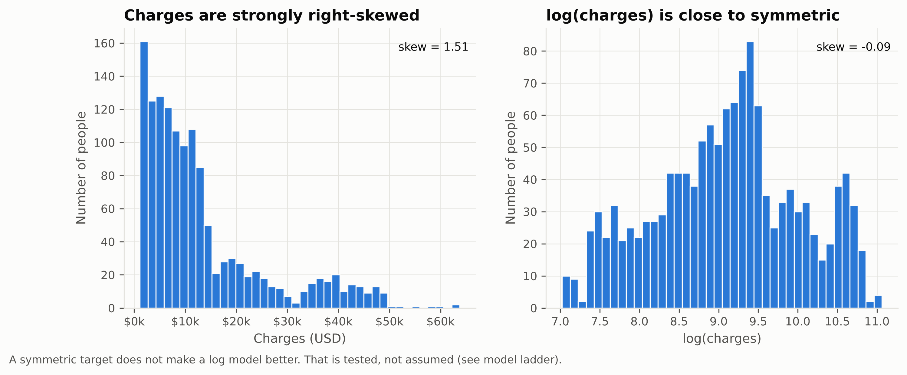 | 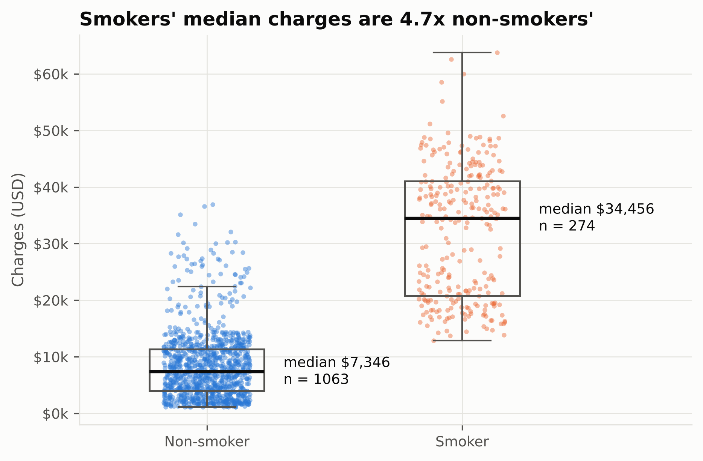 |

Charges skew right (1.52) while log(charges) is near-symmetric (−0.09). That makes a log model *tempting*.
It is tested in §4, not assumed. Smokers' median charge is **4.7×** that of non-smokers ($34,456 vs $7,346).

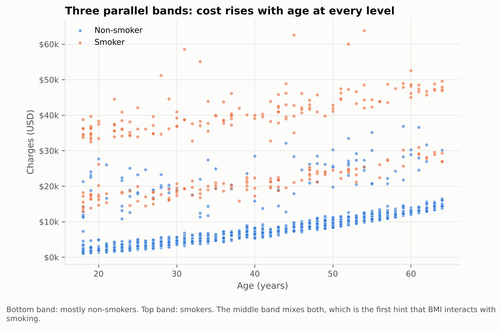

**Three parallel bands.** Cost climbs with age in every band at roughly the same slope, so age acts
*additively* (a shift), not multiplicatively. The bottom band is almost all non-smokers, the top band
all smokers, and the middle band is a mix. Something splits the smokers.

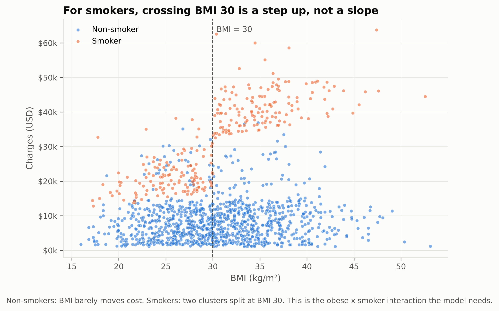

**That something is BMI 30.** For non-smokers, BMI barely matters. For smokers there are two clusters
with a clean break at the obesity threshold: mean charges **$21,363** (smoker, BMI < 30) vs **$41,558**
(smoker, BMI ≥ 30). This is a step, not a slope, which is why the model gets an `obese` flag *and* an
`obese × smoker` interaction rather than just `bmi`.

| | |
|---|---|
| 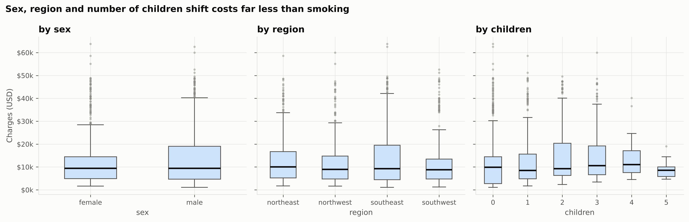 | 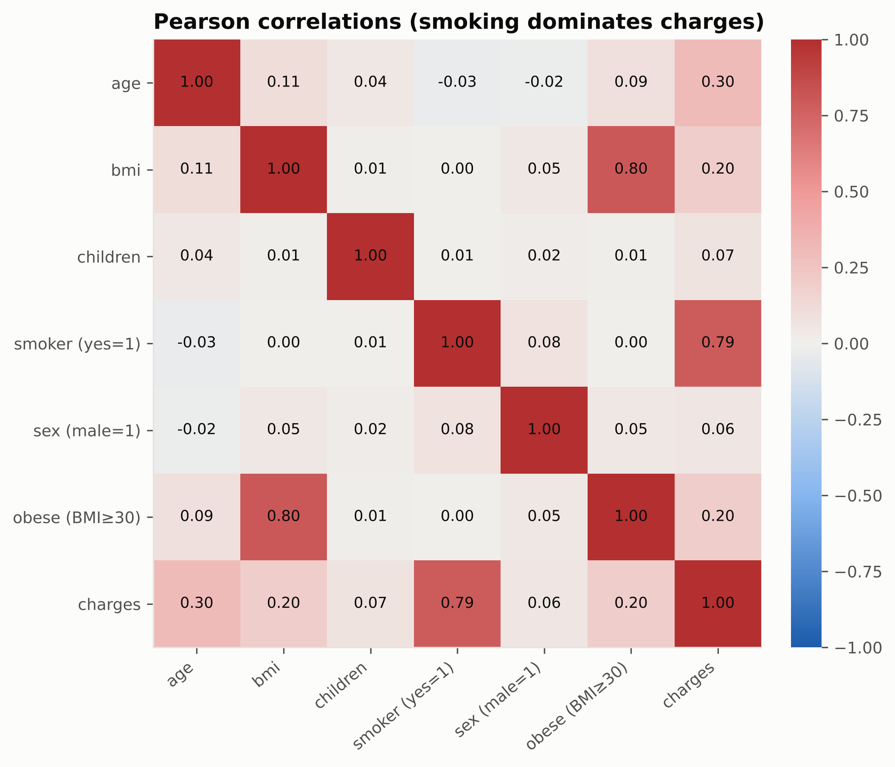 |

## 4. The model ladder

Each step adds one idea that a figure motivated. All models are scored on the **same dollar scale**, on
the **same 5 folds** (`seed = 42`). The log model is back-transformed with Duan's smearing estimator
(factor 1.130), so the comparison is fair.

| Model | Terms added | In-sample R² | CV R² (mean ± SD) | CV RMSE | CV MAE |
|---|---|---|---|---|---|
| M0 | all six variables, linear | 0.751 | 0.739 ± 0.049 | $6,105 | $4,210 |
| M1 | + age² (centred) | 0.754 | 0.741 ± 0.045 | $6,085 | $4,174 |
| M2 | + obese (BMI ≥ 30) | 0.758 | 0.746 ± 0.042 | $6,030 | $4,254 |
| **M3** | **+ obese × smoker** | **0.866** | **0.861 ± 0.031** | **$4,451** | **$2,426** |
| M3-log | same terms, log(charges) | 0.340 * | 0.283 ± 0.317 | $10,013 | $5,074 |

\* M3-log reports R² = 0.790 **on the log scale**, which looks respectable. On dollars it is 0.340.

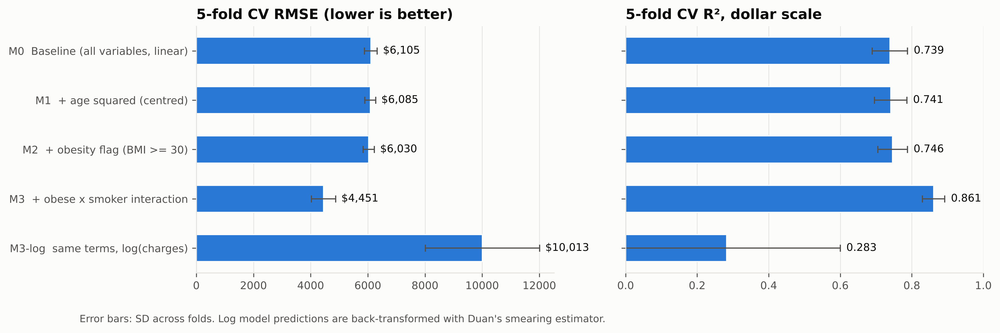

### Why the log model fails here

A log model makes every effect a *percentage*: smoking multiplies cost, obesity multiplies it again, age
multiplies it again. The age plot already showed that the real structure is additive (parallel bands).
Forcing multiplication makes predictions for older obese smokers explode past **$100,000** when the
largest observed charge is $63,770:

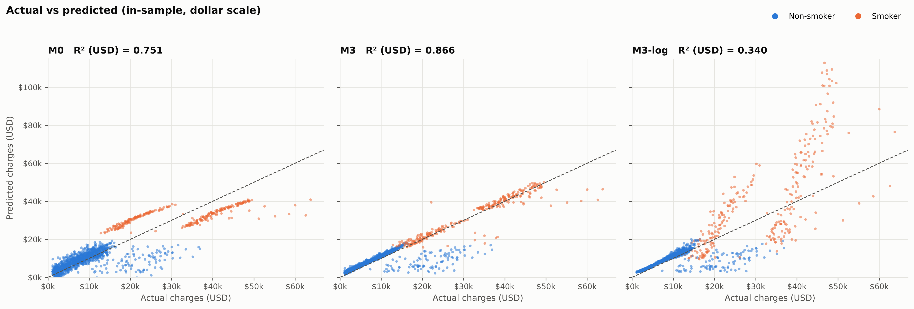

A symmetric target distribution is not a reason to log-transform. The question is whether effects add
or multiply, and here they add.

## 5. Interpreting the final model (M3)

Age is centred at its mean (39.2) before squaring, so the `age` coefficient reads as *the slope at the
average age*. This is a pure reparametrisation: identical fit and predictions, but VIF for age fell from
**47.8 to 1.0**.

| Term | Coef (USD) | 95% CI (OLS) | p | Plain-language reading |
|---|---|---|---|---|
| smoker = yes | **13,405** | 12,541 to 14,268 | < 0.001 | Non-obese smoker vs non-obese non-smoker |
| obese × smoker | **19,809** | 18,622 to 20,995 | < 0.001 | Extra cost when a smoker is also obese |
| age (centred) | 260 | 243 to 277 | < 0.001 | Per year, at age 39 |
| age² (centred) | 3.74 | 2.27 to 5.20 | < 0.001 | The yearly increase grows with age |
| children | 678 | 470 to 886 | < 0.001 | Per dependent |
| bmi | 120 | 53 to 187 | < 0.001 | Per BMI point |
| obese | −996 | −1,826 to −165 | 0.019 | Read together with `bmi` (see below) |
| region = southwest | −1,223 | −1,911 to −535 | < 0.001 | vs northeast |
| region = southeast | −829 | −1,519 to −139 | 0.019 | vs northeast |
| region = northwest | −276 | −962 to 410 | 0.430 | Not distinguishable from northeast |
| sex = male | −495 | −975 to −15 | 0.043 | Borderline (see below) |

**Putting smoking and obesity together:** at the same BMI, age, sex, region and number of children, an
obese smoker pays about **$13,405 + $19,809 = $33,213** more than an obese non-smoker.

**Two coefficients that need care:**

- **`obese` is negative.** It is estimated *alongside* the continuous `bmi` term, so it is not "obesity
  saves money". For a non-smoker, going from BMI 29 to 31 changes the prediction by 2 × $120 − $996 ≈ −$756,
  which matches the raw data: non-obese and obese non-smokers differ by only $879 in mean charges. The two
  terms share information and should be read jointly.
- **`sex` flips sign.** Unadjusted, men's mean charges are **$1,405 higher**. Adjusted, men are **$495
  lower**. The difference is smoking: men smoke more often (§2), so the raw gap was a smoking gap. Its
  p-value of 0.043 (HC3: 0.046, bootstrap CI upper bound −$6) is borderline, so this should not be
  sold as a real sex effect.

### SHAP

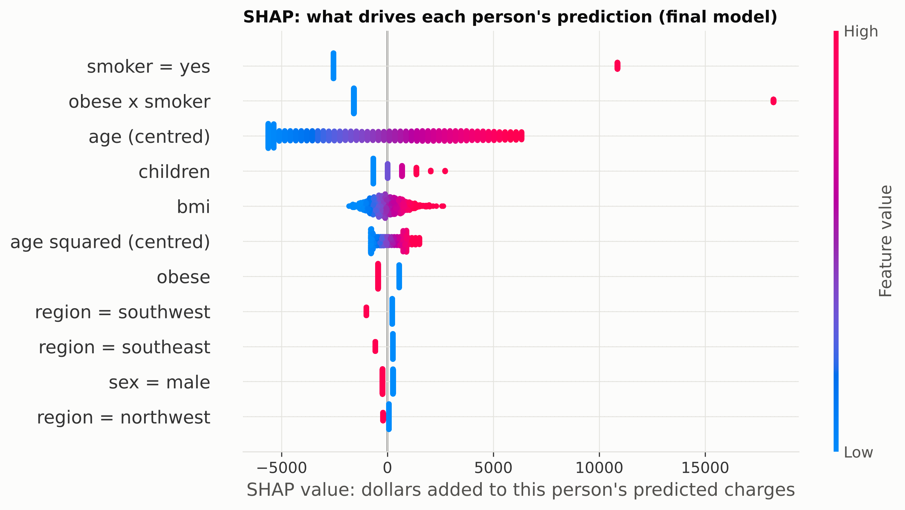

For a linear model, SHAP values are exactly `coef × (x − mean(x))`, so SHAP adds **no information** beyond
the coefficients. It is included as a presentation layer: it shows the effect in dollars, person by person.
Mean |SHAP|: smoker $4,250, obese × smoker $3,389, age $3,183, children $648, bmi $591.

## 6. Assumption diagnostics

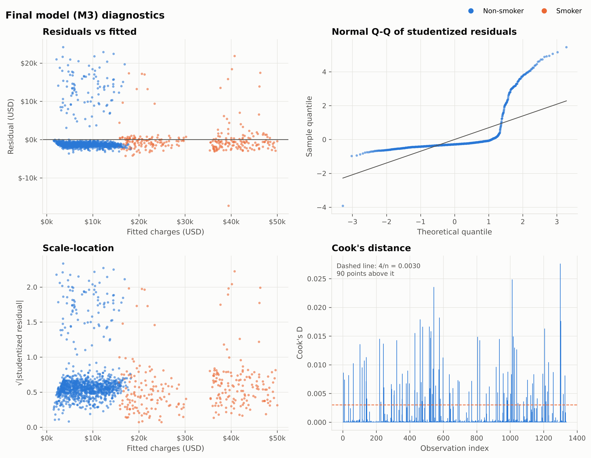

| Assumption | Test | Statistic | p-value | Verdict |
|---|---|---|---|---|
| Linearity / functional form | Ramsey RESET (power 2) | F = 0.15 | 0.703 | ✓ No missing curvature |
| Homoscedasticity | Breusch-Pagan | LM = 4.51 | 0.953 | ✓ |
| Homoscedasticity | White (special form) | LM = 0.39 | 0.822 | ✓ |
| Independence | Durbin-Watson | 2.065 | n/a | ✓ (row order carries no time meaning; reported for completeness) |
| Multicollinearity | VIF (max) | 3.02 (`obese`) | n/a | ✓ All below 5 |
| **Normality of errors** | Jarque-Bera | 7,702 | < 0.001 | ✗ **Fails** |
| **Normality of errors** | Shapiro-Wilk | W = 0.482 | < 0.001 | ✗ **Fails** (residual skew 3.17) |

The White test is used in its special form (e² on ŷ and ŷ²) because the full version squares every
regressor, and with dummy variables (`obese² = obese`) its auxiliary design becomes rank-deficient.

**Influence:** 90 observations exceed Cook's D > 4/n (0.0030). 88 of them have |studentized residual| > 2,
and 87 of those are *under*-predicted, so they are the same people as the unexplained tail below, not data
errors. None was removed.

### The tail the data cannot explain

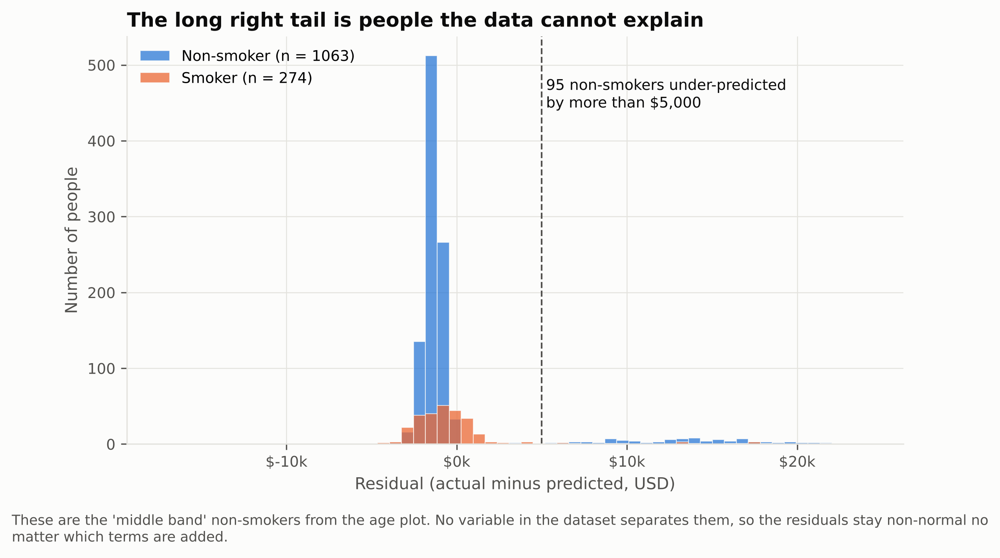

| Group | n | Mean charges | Mean age | Mean BMI | Mean residual |
|---|---|---|---|---|---|
| Non-smoker, residual ≤ $5k | 968 | $7,072 | 39.4 | 30.6 | −$1,350 |
| **Non-smoker, residual > $5k** | **95** | **$22,390** | **39.4** | **31.0** | **+$13,753** |
| Smoker, residual ≤ $5k | 257 | $31,136 | 38.6 | 30.6 | −$867 |
| Smoker, residual > $5k | 17 | $45,870 | 38.0 | 32.8 | +$13,114 |

The 95 under-predicted non-smokers have **the same average age and BMI** as everyone else. Nothing in the
seven columns separates them. Whatever drives their costs (a chronic condition, a hospital stay, a plan
difference) is simply not recorded. This is why residual normality fails no matter which terms are added,
and it is the honest ceiling of this dataset.

## 7. Does the normality failure break the inference?

With non-normal errors, classical OLS standard errors rely on large-sample theory (n = 1,337 helps). To
check, every confidence interval was rebuilt two more ways: **HC3 robust** covariance and a
**2,000-replicate pairs bootstrap** (`seed = 42`).

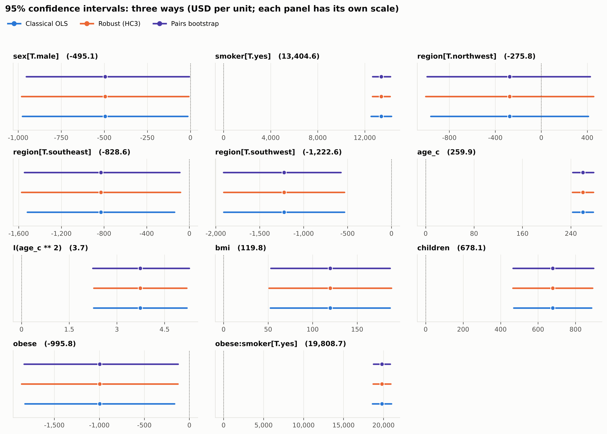

All three methods agree. No coefficient changes significance at α = 0.05 between methods. The biggest
shifts are on the two smoking terms, where robust and bootstrap SEs are actually *smaller* than classical
(smoker: $440 → $381 HC3 / $382 bootstrap; obese × smoker: $605 → $559 / $536). The headline conclusions
do not depend on the normality assumption. Full table: `outputs/tables/13_coefficients_three_ci.csv`.

## 8. Limitations

- **Cross-sectional and observational.** Coefficients are adjusted associations, not causal effects.
- **The 95-person tail** (§6) is a missing-variable problem. No model on these seven columns will fix it.
- **Prediction intervals are unreliable** even though the coefficient CIs are fine: the residuals are
  strongly right-skewed, so a symmetric ±1.96σ band would be wrong for individuals.
- **The BMI 30 threshold is clinical, not tuned.** A data-driven breakpoint could fit slightly better
  but would be fitted on the same data it is evaluated on.
- **Small, decades-old teaching dataset.** Regions are coarse, and costs reflect one unspecified time and insurer.

## Project structure

```
medical-cost-regression/
├── config.yaml              # every path, threshold and model formula
├── main.py                  # orchestrates the full pipeline
├── src/
│   ├── data_processor.py    # load, validate, de-duplicate, feature engineering
│   ├── eda.py               # descriptive stats, chi-square, Mann-Whitney, Kruskal-Wallis
│   ├── models.py            # model ladder, Duan smearing, K-fold CV on the dollar scale
│   ├── diagnostics.py       # assumption tests, VIF, influence, bootstrap, CI comparison
│   ├── explain.py           # SHAP for the OLS model
│   └── visualize.py         # all 12 figures (300 dpi)
├── tests/test_pipeline.py   # 8 tests, all on the real data
├── data/raw/insurance.csv
└── outputs/
    ├── figures/             # 12 PNGs
    └── tables/              # 18 CSV/TXT tables + run_summary.json
```

## Run it

```bash
git clone https://github.com/MelihOrel/medical-cost-regression.git
cd medical-cost-regression
python -m venv .venv && source .venv/bin/activate   # Windows: .venv\Scripts\activate
pip install -r requirements.txt

python main.py          # about 10 seconds; writes outputs/figures and outputs/tables
pytest -q               # 8 tests
```

To try a different model, edit a formula in `config.yaml` and rerun. Every table and figure regenerates.

## Reproducibility

- Fixed seed (`42`) for CV folds, bootstrap and SHAP background.
- No hand-typed numbers in figures: every title and annotation is computed from the data at run time.
- Every number in this README comes from `outputs/tables/` produced by `python main.py`.

## Tech stack

Python · statsmodels · pandas · NumPy · SciPy · scikit-learn (CV only) · matplotlib · SHAP · PyYAML · pytest

## Author

**Melih Can Orel**, Data Scientist / ML Engineer
[GitHub](https://github.com/MelihOrel) · [LinkedIn](https://linkedin.com/in/melihorel) · melihorel96@gmail.com

## License

Code: MIT (see `LICENSE`). Dataset: described by its Kaggle uploader as public domain, from *Machine Learning with R* (Brett Lantz).
